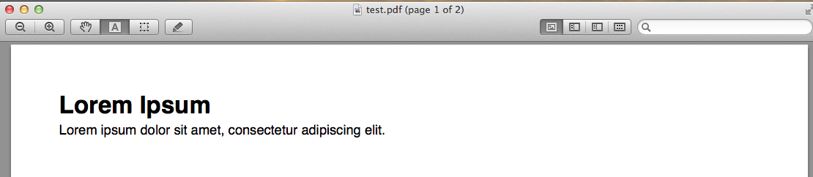
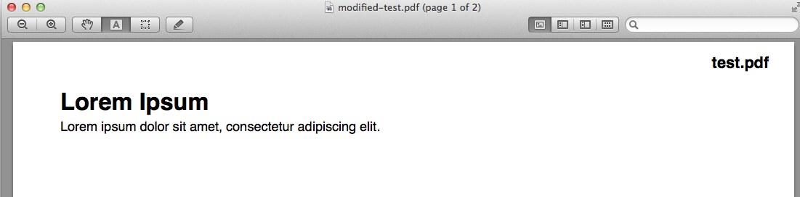

# pdfstamper

Stamps each page of a PDF file with its name in the upper right corner. Clojure
implementation of Christopher Suarez's Java-version [available here](http://feathertrail.blogspot.se/2013/10/stamp-pdf-with-its-file-name.html).

## Build

Build it using [Leiningen](http://leiningen.org/):

    $ lein uberjar
    $ ls target
    ...
    pdfstamper-0.1.0-SNAPSHOT-standalone.jar

## Usage

You can give it either the name of a PDF file to stamp, or a directory, in which
case it will process all PDF files in that directory. It supports both short and
long options.

    $ java -jar target/pdfstamper-0.1.0-standalone.jar -f /tmp/test.pdf

    $ java -jar target/pdfstamper-0.1.0-standalone.jar --directory /tmp

There is help available:

    $ java -jar target/pdfstamper-0.1.0-standalone.jar -h
    Need to stamp a pdf file with it's filename? Here you go.

     Switches               Default  Desc
     --------               -------  ----
     -h, --no-help, --help  false    Show help
     -d, --directory                 All pdf's in this folder will be processed
     -f, --file                      This file will be processed
     -x, --offset-x         20       The horizontal offset from the rightmost part of the page
     -y, --offset-y         20       The vertical offset from the top of the page

You can also run it using Leiningen. Note that you need to tell Leiningen where
the application flags start with a double dash:

    $ lein run -- -f /tmp/test.pdf

## Examples

Before stamper:

After stamper:

## Tools

Thanks to the great projects [tools.cli](https://github.com/clojure/tools.cli) and [Apache PdfBox](http://pdfbox.apache.org/).

## License

Copyright © 2013 Ulrik Sandberg

Distributed under the Eclipse Public License either version 1.0 or
any later version.
